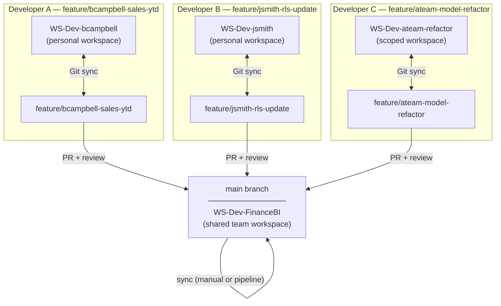
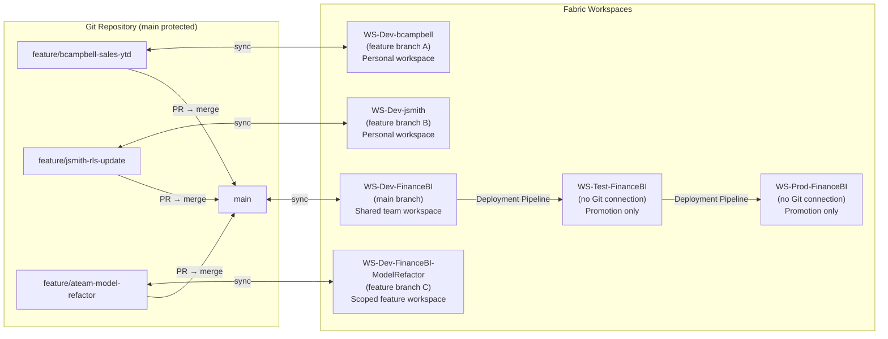

# Branching Strategy — Feature Branch Development in Microsoft Fabric

## Why Branching Strategy Matters in Fabric

Traditional Git-based development tools let multiple developers work on the same codebase in parallel by creating isolated branches. Microsoft Fabric extends this same isolation **all the way into the live workspace** — a developer does not just work on a separate branch in a text editor, they can spin up an entire Fabric workspace connected to that branch, with reports, semantic models, and dataflows rendering live against real data.

This creates a powerful but consequential dynamic: **mistakes and in-progress work are visible as running Fabric items**, not just as text files. A half-finished measure or a broken relationship is not a diff in a file — it is a broken report that someone else in the same workspace will immediately see.

The **branch-out strategy** solves this by pairing each feature branch with a dedicated personal or feature-scoped workspace. Work stays completely isolated until a PR is approved and merged to `main`.

---

## Core Concepts

### Trunk-Based Development with Workspace Isolation

The team's authoritative state lives on `main`, which is synced to the **shared Dev workspace** (`WS-Dev-<team>`). Developers never work directly in this workspace. Instead, each feature gets its own short-lived branch *and* its own short-lived workspace.



---

## The Branch-Out Workflow

### Step 1 — Create the Feature Branch

Create a short-lived branch from `main` following the naming convention:

```
feature/<alias>-<short-description>
```

**Examples:**

| Branch Name | Purpose |
|---|---|
| `feature/bcampbell-sales-ytd` | Add YTD sales measure |
| `feature/jsmith-rls-update` | Update RLS role bindings |
| `feature/ateam-model-refactor` | Refactor semantic model relationships |

**Azure DevOps:**
```
Repos → Branches → New branch
  Name:  feature/<alias>-<task>
  Based on: main
```

**Git CLI:**
```bash
git fetch origin
git checkout -b feature/<alias>-<task> origin/main
git push -u origin feature/<alias>-<task>
```

---

### Step 2 — Provision the Feature Workspace

Create a new Fabric workspace dedicated to this feature. This prevents any in-progress or experimental changes from appearing in the shared team workspace.

1. In the Fabric portal, click **+ New workspace** (left nav, bottom).  
2. Name it following the convention:
   - **Personal work:** `WS-Dev-<alias>` (e.g., `WS-Dev-bcampbell`)  
   - **Team feature:** `WS-Dev-<team>-<feature>` (e.g., `WS-Dev-FinanceBI-ModelRefactor`)  
3. Assign it to the same **Fabric capacity** as the shared Dev workspace (F2+).  
4. Set permissions: add your BI Lead as **Member**; keep others out until review time.

> **Capacity cost:** Every workspace assigned to a Fabric capacity consumes capacity units while items are actively being used. Personal dev workspaces for short features are a minor cost. For longer-running work, confirm with your capacity admin.

---

### Step 3 — Connect the Feature Workspace to the Feature Branch

1. Open the new feature workspace.  
2. Go to **Workspace settings → Git integration**.  
3. Connect to the same repo used by the team.  
4. Set the **Branch** to your feature branch (e.g., `feature/bcampbell-sales-ytd`).  
5. Set the **Folder path** to the same folder used by the shared workspace (e.g., `/fabric-workspace`).  
6. Click **Connect and sync**.

Fabric pulls the current state of `main` (via the feature branch, which was just created from it) into the new workspace. You start with a clean baseline that mirrors production.

```
Feature workspace after connect:
┌──────────────────────────────────────────────────┐
│  WS-Dev-bcampbell                                 │
│  Branch: feature/bcampbell-sales-ytd              │
│  ─────────────────────────────────────────────── │
│  SalesReport.Report          ✔ Synced             │
│  SalesModel.SemanticModel    ✔ Synced             │
│  SalesDataflow.Dataflow      ✔ Synced             │
└──────────────────────────────────────────────────┘
```

---

### Step 4 — Develop in Isolation

Make your changes directly in the feature workspace using the Fabric portal or Power BI Desktop synced to the same branch. Your changes are fully isolated:

- The **shared `WS-Dev-<team>` workspace** is unaffected — colleagues see no noise from your work.  
- You can break, experiment, and iterate freely without review pressure.  
- Other developers are simultaneously working in their own feature workspaces on different branches.

When you are ready to save a checkpoint:

1. Open **Source control** in your feature workspace.  
2. Review **Outgoing changes** — these are local workspace edits not yet in Git.  
3. Write a descriptive commit message: `feat: add YTD sales measure with LY comparison`.  
4. Click **Commit**.  
5. The change is pushed to `feature/bcampbell-sales-ytd` in the remote repo.

---

### Step 5 — Keep the Branch Up to Date (rebase/merge from main)

While you are working, other PRs may merge into `main`. Pull those changes into your feature branch regularly:

**Azure DevOps — Update branch:**
```
Repos → Branches → [your branch] → ⋮ → Update branch (rebase onto main)
```

**Git CLI:**
```bash
git fetch origin
git rebase origin/main
git push --force-with-lease origin feature/<alias>-<task>
```

Then in the Fabric feature workspace:
1. Open **Source control → Incoming changes**.  
2. Click **Update all** to apply the rebased changes to your workspace items.

This keeps merge conflicts small and ensures your feature is always building on the latest state of `main`.

---

### Step 6 — Open the Pull Request

When the feature is complete and tested in your workspace:

1. Open a PR from `feature/<alias>-<task>` into `main`.  
2. The **CI pipeline triggers automatically** — validation, DAX tests, lint.  
3. Add the required reviewer(s).  
4. In the PR description, include:
   - What changed and why  
   - A screenshot of the report in the feature workspace  
   - Links to any related work items  

> **Reviewer tip:** Reviewers can check out the feature branch into *their own* personal workspace to preview the live report before approving, rather than only reading a diff.

---

### Step 7 — Merge and Clean Up

After the PR is approved and CI is green:

1. Merge using **Squash merge** (keeps `main` history clean).  
2. Delete the feature branch.  
3. **Delete the feature workspace** (or repurpose it for the next feature):
   - Go to **Workspace settings → Other settings → Delete this workspace**.  
   - Confirm deletion.  

The shared `WS-Dev-<team>` workspace syncs to `main` automatically (Approach B pipeline) or via manual **Update all** in the Source control panel (Approach A).

---

## Full Topology Diagram



---

## When to Use a Personal Workspace vs Shared Dev

| Scenario | Recommendation |
|---|---|
| Small, isolated change (single report page, one measure) | Personal workspace — full isolation for even small work |
| Large model refactor involving multiple items | Scoped feature workspace (`WS-Dev-<team>-<feature>`) with the full team collaborating on the one branch |
| Hotfix needed in less than an hour | Can work directly in the shared Dev workspace on a hotfix branch, merge fast |
| Experimentation / proof of concept | Personal workspace; may never result in a PR |
| Reviewer previewing a PR | Create a temporary personal workspace connected to the PR's branch |
| Parallel release streams | Two scoped feature workspaces tracking two different release branches |

---

## Naming Convention Summary

| Workspace type | Pattern | Example |
|---|---|---|
| Shared team dev | `WS-Dev-<Team>` | `WS-Dev-FinanceBI` |
| Personal dev (any work) | `WS-Dev-<alias>` | `WS-Dev-bcampbell` |
| Scoped team feature | `WS-Dev-<Team>-<Feature>` | `WS-Dev-FinanceBI-ModelRefactor` |
| Test | `WS-Test-<Team>` | `WS-Test-FinanceBI` |
| Prod | `WS-Prod-<Team>` | `WS-Prod-FinanceBI` |

---

## Why This Strategy Matters

### Isolation prevents regression
Changes in one branch cannot break items in another developer's workspace. A developer exploring a structural model change does not interrupt a colleague finishing a report page.

### Reviewers can preview live output
Because the feature workspace is a fully functional Fabric environment, reviewers can look at actual rendered reports — not just JSON diffs — before approving a PR. This dramatically improves review quality for visual BI work.

### Parallel development at scale
Multiple developers and teams can work simultaneously without coordination overhead. There is no concept of "locking" a workspace — each person works in their own isolated environment.

### Clean shared workspace
The shared `WS-Dev-<team>` workspace always reflects the latest merged, reviewed state of `main`. Stakeholders can preview development progress there without seeing half-finished features.

### Safe experimentation
A personal workspace connected to a throwaway branch gives developers a risk-free environment for trying new DAX patterns, testing DirectQuery performance, or experimenting with composite models — with nothing to roll back except deleting the branch and workspace.

### Supports modern DataOps
The pattern mirrors how software engineering teams run feature environments (preview deployments, review apps) — applied to the Fabric ecosystem. It is a foundational practice for teams that treat their BI artifacts as production-grade software.

---

## Anti-Patterns to Avoid

| Anti-pattern | Why it's harmful | Better approach |
|---|---|---|
| Editing directly in `WS-Dev-<team>` (shared workspace) | Everyone sees your in-progress work; conflicts likely | Always branch out to a personal workspace |
| Long-lived feature branches (> 2 weeks) | Massive merge conflicts; stale shared dev workspace | Break large features into smaller PRs; keep branches short |
| Connecting Test or Prod workspaces to Git branches | Bypasses deployment pipeline governance | Test and Prod receive content only via Deployment Pipelines |
| Reusing a personal workspace across unrelated features | Changes from old work bleed into new feature | Delete or re-connect the workspace to the new branch |
| Skipping the feature workspace for "quick" changes | No isolation; harder to revert; harder to review | Even one-line fixes benefit from branch isolation |

---

## Related Documents

- [Workspace Strategy](workspace-strategy.md) — naming conventions, roles, and workspace lifecycle  
- [CI/CD Architecture](cicd-architecture.md) — how CI validates feature branches before merge  
- [Lab 1 — Connect Workspace to Git](../workshop-plan/labs/lab1-connect-git.md) — hands-on: connect a workspace to a branch  
- [Lab 2 — CI Pipeline & Workspace Sync](../workshop-plan/labs/lab2-ci-pipeline.md) — CI pipeline and workspace sync after merge  
