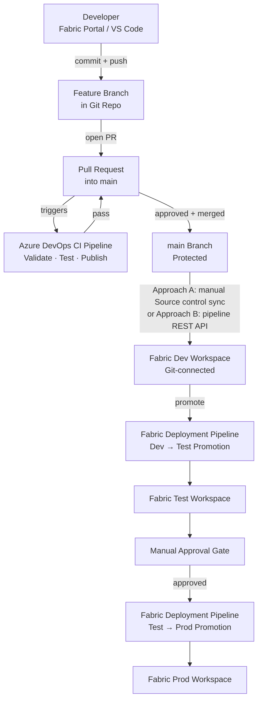
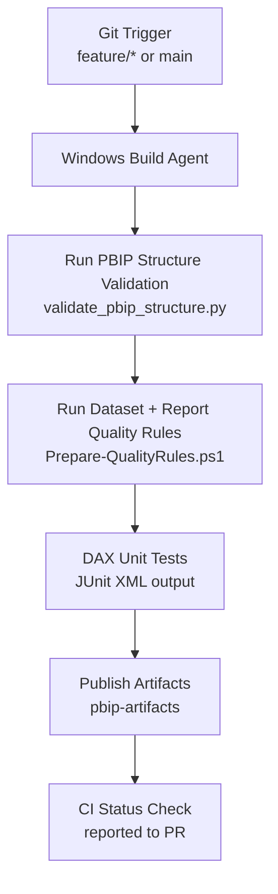
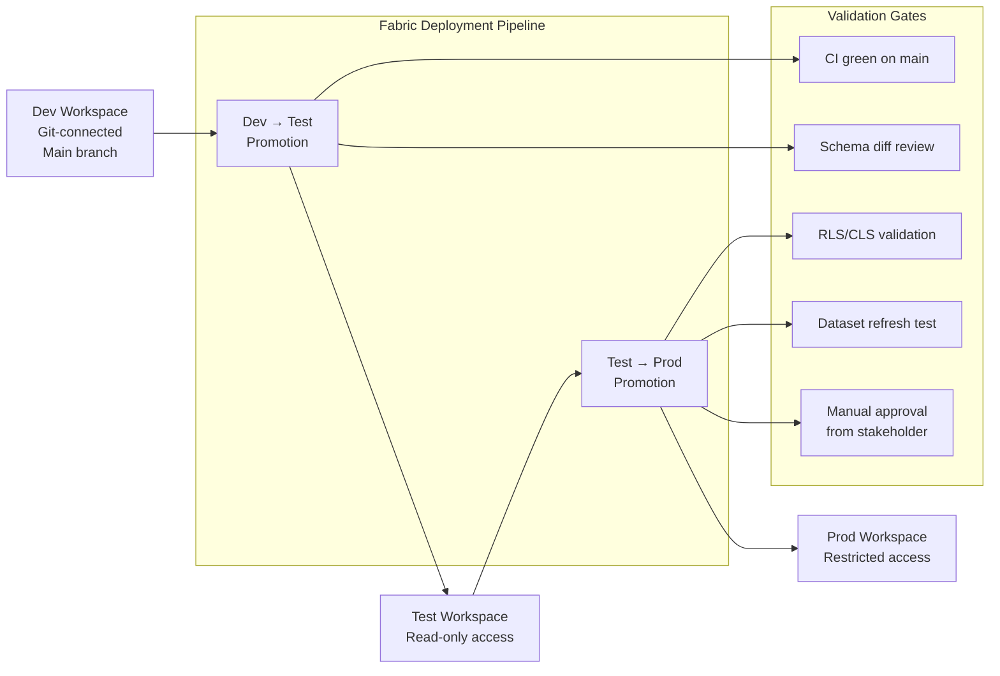

# CI/CD Architecture

This document describes the end-to-end **CI/CD architecture** for Microsoft Fabric workspaces that use Power BI Projects (PBIP) and Git-based lifecycle management.

---

## Architecture Overview

The pipeline spans two complementary systems:

| System | Purpose |
|---|---|
| **Azure DevOps / GitHub Actions** | Continuous Integration — validates PBIP artifacts on every push/PR |
| **Fabric Deployment Pipelines** | Continuous Delivery — promotes validated content across Dev → Test → Prod workspaces |

Together they enforce that no unvalidated, unreviewed change can reach the production workspace.

---

## End-to-End Flow

---

## CI Pipeline Detail

The CI pipeline (defined in `azure-pipelines.yml`) runs on every push to `main` or `feature/*`.

### Pipeline Stages

| Stage | Steps | Failure Behaviour |
|---|---|---|
| **Validate** | `validate_pbip_structure.py`, dataset rules, report rules | Fails build immediately |
| **Test** | DAX unit tests via `run_dax_tests.py` | Fails build; JUnit results published |
| **Publish** | `PublishBuildArtifacts` | Skipped if prior stage fails |

---

## Deployment Pipelines

### Dev → Test → Prod

Fabric Deployment Pipelines manage the promotion of workspace content across environments. Each stage is bound to a dedicated Fabric workspace.

### Promotion Checklist

Before promoting from **Dev → Test**:
- [ ] CI pipeline passes on `main`  
- [ ] No schema drift detected (compare against last known-good artifact)  
- [ ] All report visuals render correctly in Dev workspace  
- [ ] Dataset refresh completes without errors  

Before promoting from **Test → Prod**:
- [ ] UAT sign-off from stakeholders  
- [ ] RLS role bindings validated for all personas  
- [ ] CLS column-level security reviewed  
- [ ] Sensitivity labels applied  
- [ ] Connection string parameters swapped (Dev → Prod data sources)  
- [ ] Manual approval granted in the Deployment Pipeline UI  

---

## Workspace-to-Branch Mapping

The **branch-out strategy** extends the standard Dev/Test/Prod topology with personal and scoped feature workspaces. Each feature branch has a corresponding isolated workspace; only `main` feeds the shared team Dev workspace.

| Workspace | Branch | Git Integration | Purpose |
|---|---|---|---|
| `WS-Dev-<team>` | `main` | Connected — auto-sync on merge | Shared team baseline |
| `WS-Dev-<alias>` | `feature/<alias>-*` | Connected to feature branch | Personal isolated development |
| `WS-Dev-<team>-<feature>` | `feature/<team>-*` | Connected to feature branch | Scoped multi-developer feature |
| `WS-Test-<team>` | — | Promoted via Deployment Pipeline, not Git | UAT / integration |
| `WS-Prod-<team>` | — | Promoted via Deployment Pipeline, not Git | Live production |

> Personal and scoped feature workspaces are **ephemeral** — they are created for the duration of the feature branch and deleted after the PR merges. Only the shared Dev, Test, and Prod workspaces are permanent.
>
> See [Branching Strategy](branching-strategy.md) for the full branch-out workflow.

---

## Security Considerations

- **Service principal** used for automated pipeline operations; no personal credentials stored in the pipeline.  
- Secrets (connection strings, API keys) stored in **Azure Key Vault** and referenced via pipeline variable groups linked to the Key Vault.  
- Branch policies on `main` require:
  - Minimum **1 reviewer** approval  
  - Linked CI build passing  
  - Comment resolution  
- Fabric workspace permissions follow least-privilege: Prod workspace is **Viewer-only** for all non-admin accounts.

---

## Related Documents

- [Lab 2 — Build CI Pipeline for PBIP](../workshop-plan/labs/lab2-ci-pipeline.md)  
- [Workspace Strategy](workspace-strategy.md)  
- [Governance Checklist](../governance/governance-checklist.md)  
- [Fabric + Git Integration Architecture](fabric-git-integration.md)
