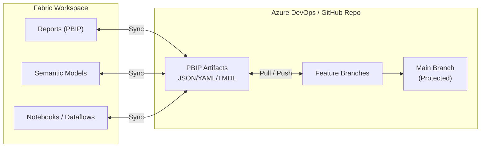
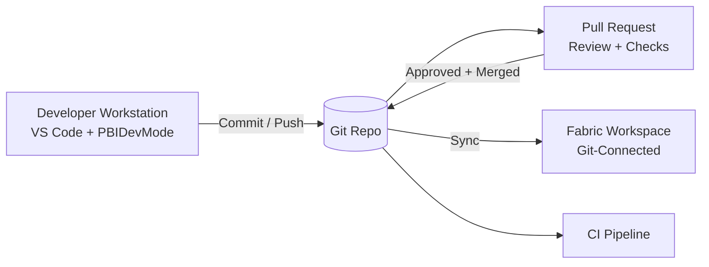
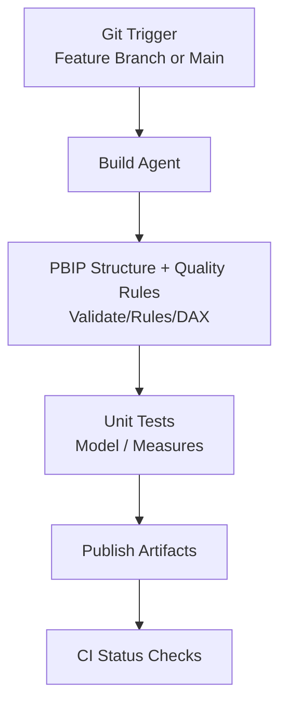
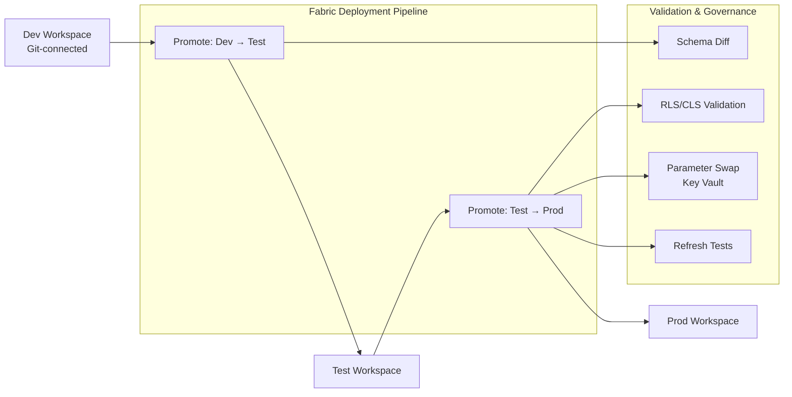
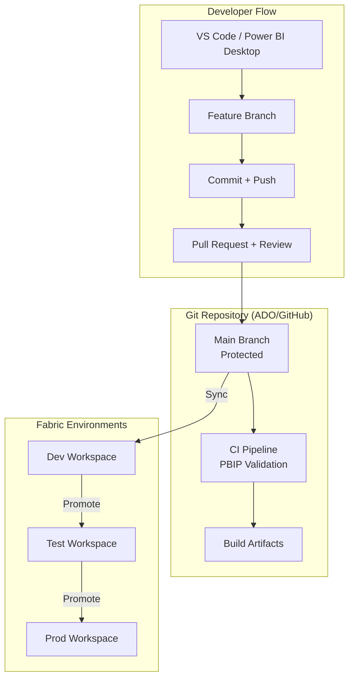
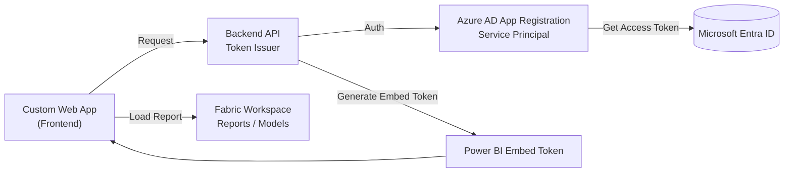

# Fabric + Git Integration Architecture

---

# `/docs/architecture/pbip-dev-workflow.md`

# PBIP Development Workflow

---

# `/docs/architecture/ci-pipeline.md`

# CI Pipeline for PBIP (Azure DevOps)

---

# `/docs/architecture/deployment-pipeline.md`

# Fabric Deployment Pipeline (Dev → Test → Prod)

---

# `/docs/architecture/end-to-end-devops.md`

# End-to-End Fabric DevOps Architecture

---

# `/docs/architecture/powerbi-embedded.md`

# Power BI Embedded (App‑Owns‑Data) Architecture

---