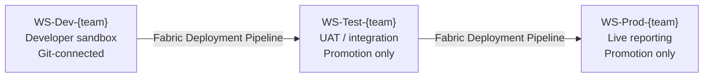

# Workspace Strategy

This document defines the recommended **workspace topology** for teams using Microsoft Fabric with Git-backed lifecycle management. It establishes how workspaces map to environments, how they are named, who can access them, and how they relate to branches in the Git repository.

---

## Workspace Topology

Teams use a minimum of three workspaces — one per environment — to safely promote content from active development through to production without exposing in-progress work to end users.



| Workspace | Purpose | Who Works Here | Git Connected |
|---|---|---|---|
| `WS-Dev-<team>` | Active development; experiments; feature work | Data Engineers, BI Developers | **Yes** — `main` branch |
| `WS-Test-<team>` | UAT, integration testing, stakeholder review | QA, SMEs, BI Lead | No — promoted via pipeline |
| `WS-Prod-<team>` | Live production reporting | End users (Viewer) | No — promoted via pipeline |

> For large teams with parallel workstreams, a developer may check out a feature branch into a **personal dev workspace** (`WS-Dev-<alias>`) before merging back to the shared dev workspace on `main`.

---

## Workspace Naming Convention

Follow this standard to keep workspaces identifiable across projects and teams:

```
WS-{Environment}-{Team/Project}[-{Qualifier}]
```

**Examples:**

| Workspace Name | Description |
|---|---|
| `WS-Dev-FinanceBI` | Dev workspace for the Finance BI team |
| `WS-Test-FinanceBI` | Test workspace for the Finance BI team |
| `WS-Prod-FinanceBI` | Production workspace for the Finance BI team |
| `WS-Dev-bcampbell` | Personal dev workspace for developer bcampbell |
| `WS-Dev-SalesBI-Refresh` | Scoped dev workspace for a dataflow refresh project |

**Rules:**
- Use **PascalCase** for the team/project segment.  
- Keep names ≤ 50 characters.  
- Do not embed dates in workspace names — use release tags in Git instead.  
- Use hyphens as separators; avoid spaces and underscores.

---

## Permission Model

Apply the **principle of least privilege**. No team member should hold a role broader than what their job function requires.

### Fabric Workspace Roles

| Role | Capabilities |
|---|---|
| **Admin** | Full control including workspace settings, Git integration, and capacity assignment |
| **Member** | Create, publish, and delete content; cannot change workspace settings |
| **Contributor** | Create and modify content; cannot delete workspace-level items |
| **Viewer** | Read-only access to published reports and dashboards |

### Recommended Role Assignments by Environment

| Role | Dev | Test | Prod |
|---|---|---|---|
| BI Lead / Team Lead | Admin | Admin | Admin |
| Senior BI Developer | Member | Contributor | Viewer |
| BI Developer | Contributor | Viewer | Viewer |
| QA / Tester | Viewer | Contributor | Viewer |
| Stakeholder / Business User | — | Viewer | Viewer |
| Service Principal (CI/CD) | Member | Member | Member |

> In **Prod**, only the CI/CD service principal and team leads should hold Member or higher. All humans should be Viewer unless there is an operational need.

---

## Git Branch-to-Workspace Mapping

```
main ────────────────────────── WS-Dev-<team> (auto-sync)
  └── feature/<alias>-<task>  ── WS-Dev-<alias> (optional personal workspace)
```

| Branch Pattern | Workspace | Notes |
|---|---|---|
| `main` | `WS-Dev-<team>` | Trunk; all PRs merge here; workspace auto-syncs |
| `feature/*` | `WS-Dev-<alias>` (personal) | Optional; developer checks out branch to personal workspace |
| `release/*` | — | Tagged releases; content promoted to Test/Prod via pipeline |

**Key rules:**
- Never connect `WS-Test` or `WS-Prod` to a Git branch. Promotion through Deployment Pipelines is the only authorized path.  
- Never commit directly to `main`. All changes go through a PR with at least one review.  
- Delete feature branches after merge to keep the branch list clean.

---

## Capacity and Licensing

- All workspaces used for Git integration and Deployment Pipelines must be assigned to a **Fabric capacity** (F2 or higher) or a **Premium Per User (PPU)** license.  
- Workspaces on shared/free capacity do **not** support Git integration.  
- Assign capacities via **Fabric Admin Portal → Workspaces → Assign to capacity**.

---

## Workspace Lifecycle

| Event | Action |
|---|---|
| New project starts | Provision Dev / Test / Prod workspaces; connect Dev to repo; configure Deployment Pipeline |
| Developer joins | Add with minimum required role; create personal dev workspace if needed |
| Developer leaves | Remove from all workspaces; revoke repo access; reassign items if needed |
| Project ends | Archive content to a read-only workspace; remove from capacity; retain for audit period |
| Capacity change | Re-assign workspace to new capacity; verify Git integration still active |

---

## Related Documents

- [CI/CD Architecture](cicd-architecture.md)  
- [Governance Checklist](../governance/governance-checklist.md)  
- [Lab 1 — Connect Workspace to Git](../workshop-plan/labs/lab1-connect-git.md)
