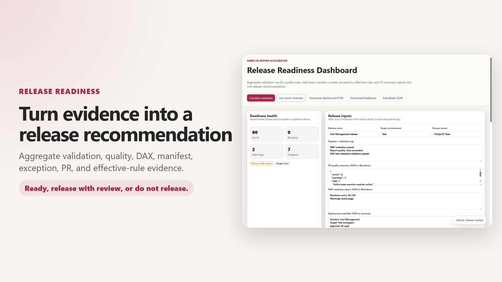

# Fabric BI DevOps Accelerator Tool Walkthrough

This guide explains what each HTML tool does, when to use it, the questions it answers, and how it improves productivity and governance.

Use the local demo project below when walking through the tools:

```text
C:\Projects\Enterprise-Fabric
```

For PBIP scanning demos, select:

```text
C:\Projects\Enterprise-Fabric\shared
```

## Recommended walkthrough flow

1. Open the launchpad.
2. Generate or review enterprise standards.
3. Tune individual rules only when needed.
4. Define DAX test metadata.
5. Create a deployment manifest.
6. Scan the PBIP project before pull request.
7. Compare before/after PBIP snapshots.
8. Analyze dependency impact.
9. Generate CI/CD pipeline YAML.
10. Generate the PR quality summary.
11. Track any approved exceptions.
12. Generate effective branch-aware rule files.
13. Review platform parity.
14. Assess release readiness.
15. Track adoption metrics.
16. Map policy coverage.
17. Compare differentiators.

## Tool catalog

### Fabric BI DevOps Accelerator Launchpad


**What it does:** Provides the central entry point for all tools, grouped by job-to-be-done.

**How to use it:**

1. Open `tools/index.html`.
2. Use the top tabs to switch between Tool catalog, Workflow, Artifacts, and Audience paths.
3. In Tool catalog, use the category menu to switch between standards, review/release, and governance/adoption tools.
4. Open the specific tool needed for the current task.

**Questions it answers:**

- Which tool should I use first?
- Which tools are for governance, release, review, or adoption?
- What artifacts can this toolkit generate?

**Productivity and governance value:** Reduces confusion by giving users one place to discover tools, workflows, audiences, and outputs.

### Enterprise Standards Builder


**What it does:** Generates baseline report and dataset quality rules from policy profiles by selecting and configuring pre-built policies.

**Capabilities:** Read and update operations only
- ✅ Select from pre-built policy profiles
- ✅ Adjust policy parameters (max visuals, page limits, etc.)
- ❌ Cannot create new policies
- ❌ Cannot delete policies
- ❌ No JSON editing

**How to use it:**

1. Open `tools/enterprise-standards-builder/index.html`.
2. Choose a profile such as Advisory, Enterprise standard, Strict, or Custom.
3. Adjust policy controls for report usability, visual standards, semantic model quality, DAX, and formatting.
4. Download generated rule files and policy summary.

**Questions it answers:**

- What should our baseline quality policy be?
- Which rules should be advisory or blocking?
- How do we create standard rule files without hand-editing JSON?

**Productivity and governance value:** Converts policy decisions into CI-ready rule files and makes governance repeatable. Designed for governance owners and report creators who prefer UI controls over JSON editing.

### Quality Rule Designer


**What it does:** Authors and maintains individual report and dataset quality rules with full create, read, update, and delete capabilities.

**Capabilities:** Full CRUD operations
- ✅ Create new rules from templates or custom JSON
- ✅ Read and inspect existing rules
- ✅ Update rule parameters and logic
- ✅ Delete rules
- ✅ Edit raw JSON logic for advanced customization

**How to use it:**

1. Open `tools/rule-designer/index.html`.
2. Load existing `Rules-Report.json` or `Rules-Dataset.json`.
3. Select a rule to edit or create a new one from a template.
4. Tune logic, severity, enabled state, or custom JSON logic.
5. Download the updated rule file.

**Questions it answers:**

- Which rule is failing?
- Can a specific threshold be adjusted?
- Can we add a custom PBI Inspector or Tabular Editor BPA rule?
- Can we create a rule that doesn't fit the preset templates?

**Productivity and governance value:** Provides complete rule authorship and maintenance for platform teams and advanced BI developers who need full control over governance rules.

**Productivity and governance value:** Lets advanced users tune rule behavior safely without rewriting full rule files.

### DAX Test Builder


**What it does:** Creates structured DAX test metadata for critical measures.

**How to use it:**

1. Open `tools/dax-test-builder/index.html`.
2. Load or start from `shared/dax-tests.json`.
3. Define test name, measure, scenario, filter context, expected outcome, severity, owner, and tags.
4. Export updated `dax-tests.json` and test catalog Markdown.

**Questions it answers:**

- Which measures need validation before release?
- Who owns each DAX test?
- What expected result or range should a measure return?

**Productivity and governance value:** Creates a consistent test catalog that can be reviewed and consumed by CI.

### Deployment Manifest Builder


**What it does:** Creates a deployment contract for a PBIP solution.

**How to use it:**

1. Open `tools/deployment-manifest-builder/index.html`.
2. Scan a PBIP folder or use the starter manifest.
3. Fill in owners, artifacts, environments, parameters, approvals, validation gates, and rollback notes.
4. Export `deployment-manifest.json` and a Markdown summary.

**Questions it answers:**

- What is being deployed?
- Who owns the solution?
- Which workspaces and parameters are used?
- What approvals and rollback plan apply?

**Productivity and governance value:** Gives release reviewers a clear deployment contract instead of relying on tribal knowledge.

### PBIP Project Readiness Scanner


**What it does:** Scans a local PBIP repository or project folder before a pull request.

**How to use it with the demo project:**

1. Open `tools/pbip-readiness-scanner/index.html`.
2. Click **Preview PBIP report folder** or equivalent folder upload control.
3. Select:

   ```text
   C:\Projects\Enterprise-Fabric\shared
   ```

4. Review structure, governance assets, references, pipeline files, and hygiene findings.
5. Export Markdown and JSON readiness reports.

**Questions it answers:**

- Is this PBIP project ready for PR?
- Are report and semantic model folders present?
- Are rules, DAX tests, manifests, and exception files present?
- Are CI/CD files wired up?

**Productivity and governance value:** Helps authors self-check before asking reviewers to spend time on a PR.

### PBIP Diff Viewer


**What it does:** Compares two PBIP snapshots and translates raw JSON/TMDL changes into reviewer-friendly categories and guidance.

**Understanding Before and After Folders**

The tool requires two PBIP folder snapshots representing different points in time:

- **Before folder**: The original PBIP project state (e.g., from `main` branch or previous commit)
- **After folder**: The modified PBIP project state (e.g., from `feature/xyz` branch or after edits)

To obtain these folders:

1. **From Git branches** (recommended for review):
   - Checkout parent branch (e.g., `git checkout develop`) → export PBIP folder
   - Checkout feature branch (e.g., `git checkout feature/my-feature`) → export PBIP folder

2. **From workspace exports**:
   - Open Power BI Desktop → File → Export → save PBIP folder
   - Make changes to your report/model
   - Export again to create the "after" folder

**How to use it:**

1. Open `tools/pbip-diff-viewer/index.html`.
2. Click **Load before folder** and select the original PBIP snapshot.
3. Click **Load after folder** and select the modified PBIP snapshot.
4. Review added, removed, and changed report, semantic model, rule, DAX test, exception, manifest, and pipeline files.
5. Filter by artifact type or path and inspect the before/after excerpts.
6. Export HTML, Markdown, or JSON diff reports for PR review.

**Questions it answers:**

- Which report pages, visuals, semantic model files, and governance assets changed?
- What should reviewers focus on instead of reading raw PBIP JSON?
- Were files added or removed intentionally?
- Which JSON properties changed in metadata files?

**Productivity and governance value:** Gives reviewers a concise change lens before they inspect raw PBIP metadata or approve a pull request.

### Dependency Impact Analyzer


**What it does:** Scans PBIP report and semantic model metadata to trace changed model objects to impacted measures, relationships, report pages, visuals, DAX tests, deployment manifests, and governance assets.

**How to use it:**

1. Open `tools/dependency-impact-analyzer/index.html`.
2. Load a PBIP project or repository folder.
3. Enter changed model objects such as `Revenue`, `Sales[Amount]`, or `Customer[Region]`.
4. Review impacted measures, relationships, visuals, pages, tests, and governance assets.
5. Export HTML, Markdown, or JSON impact reports for PR and release review.

**Questions it answers:**

- Which measures reference a changed table, column, or measure?
- Which report pages and visuals may need regression review?
- Which relationships or governance files mention the changed object?
- What should reviewers test before approval or promotion?

**Productivity and governance value:** Focuses testing and review on likely downstream impact instead of asking reviewers to manually inspect every report and model file.

### Pipeline Config Generator


**What it does:** Generates Azure DevOps, GitHub Actions, or GitLab CI YAML from one PBIP delivery profile.

**How to use it:**

1. Open `tools/pipeline-config-generator/index.html`.
2. Choose Azure DevOps, GitHub Actions, or GitLab CI.
3. Set project root, PBIP path, Python version, deploy script path, branch triggers, and enabled capabilities.
4. Review the generated YAML, setup notes, profile JSON, and checklist.
5. Download the YAML and commit it to the platform-specific pipeline location.

**Questions it answers:**

- What CI/CD YAML do we need for this PBIP project?
- Which jobs require Linux or Windows runners?
- Which secrets or variables are required for deployment?
- Which validation, quality, test, publish, and deploy stages are enabled?

**Productivity and governance value:** Converts platform setup decisions into repeatable YAML and setup notes so teams do not hand-build CI/CD pipelines from scratch.

### PR Quality Summary Generator


**What it does:** Creates reviewer-friendly PR summaries from changed files and validation evidence.

**How to use it:**

1. Open `tools/pr-quality-summary-generator/index.html`.
2. Paste changed file paths.
3. Paste pipeline logs, readiness output, DAX test output, manifest context, and deployment notes.
4. Generate Markdown and JSON summaries.
5. Paste the Markdown into the PR body.

**Questions it answers:**

- What changed?
- What validation passed or failed?
- Which rules failed?
- What should reviewers focus on?

**Productivity and governance value:** Reduces reviewer effort and standardizes PR handoffs.

### Policy Exception Register


**What it does:** Documents approved, requested, expiring, and expired policy/rule exceptions with audit-friendly metadata for compliance tracking.

**How to use it:**

1. Open `tools/policy-exception-register/index.html`.
2. Load or create `policy-exceptions.json`.
3. For each exception, capture:
   - Rule ID, owner, approver, affected artifact
   - Reason, mitigation, status, and expiration date
   - Tags for categorization (migration, finops, etc.)
4. Export JSON and Markdown summary.
5. Save to repo or download for use in governance reviews.

**Questions it answers:**

- Which rules have approved, temporary exceptions?
- Who owns the exception and when does it expire?
- Why does the exception exist?
- What is the mitigation or cleanup plan?
- How long until the exception expires?

**Productivity and governance value:** Creates a compliance-friendly audit trail of all approved exceptions. Works with the Effective Rules Generator at CI pipeline runtime.

### Effective Rules Generator


**What it does:** Merges baseline rules, branch policy, rule overrides, and approved exceptions into effective CI rule files that the pipeline will enforce. Includes a **searchable rule picker** to define rule property changes (logType, threshold, disabled).

**How to use it:**

1. Open `tools/effective-rules-generator/index.html`.
2. Load `Rules-Report.json` and `Rules-Dataset.json` (baseline rules created by Enterprise Standards Builder).
3. Use the **rule picker** to select specific rules and define changes:
   - Override `logType` (change warning ↔ error)
   - Override `threshold` (modify numeric limits in rule logic)
   - Override `disabled` (temporarily disable a rule during release)
4. Optionally paste exception register JSON from Policy Exception Register.
5. Choose source and target branches to apply branch-aware logic.
6. Generate effective rule files and summary.

**Questions it answers:**

- What rules will CI actually enforce on this branch?
- How do rule overrides, branch policy, and approved exceptions change the output?
- Which rules are disabled or have modified thresholds?
- Which dataset severities are included?
- What exceptions are active (not expired)?

**Productivity and governance value:** Makes effective enforcement transparent before CI runs and lets teams define release-specific rule adjustments without editing baseline files.

### CI/CD Platform Parity Matrix


**What it does:** Compares Azure DevOps, GitHub Actions, and GitLab CI/CD support across capabilities.

**How to use it:**

1. Open `tools/platform-parity-matrix/index.html`.
2. Load or edit `platform-parity-matrix.json`.
3. Mark each capability as supported, partial, planned, or gap per platform.
4. Export Markdown or JSON.

**Questions it answers:**

- What works across all CI/CD platforms?
- Where do we have platform gaps?
- What needs future investment?

**Productivity and governance value:** Makes the platform-neutral claim measurable and easier to explain.

### Release Readiness Dashboard



**What it does:** Aggregates release evidence into a score and recommendation.

**How to use it:**

1. Open `tools/release-readiness-dashboard/index.html`.
2. Load JSON files or paste pipeline logs, PR summary, readiness report, manifest, exceptions, effective rules, and DAX test summary:
   - **Load files:** Click "Load file" next to each section to browse and select JSON, Markdown, or text files directly.
   - **Or paste:** Manually paste content into any textarea.
3. Review score, blockers, warnings, and evidence coverage.
4. Use "Clear all" to reset the form when starting a new release assessment.
5. Export HTML, Markdown, or JSON.

**Questions it answers:**

- Is this release ready?
- What evidence is missing?
- Are there blockers or warnings?
- Should we release, release with review, or stop?

**Productivity and governance value:** Gives release managers one consolidated decision view with flexible input options (file browse or copy-paste).

### Adoption Metrics Dashboard


**What it does:** Tracks adoption, platform usage, readiness, exceptions, and time-to-onboard.

**How to use it:**

1. Open `tools/adoption-metrics-dashboard/index.html`.
2. Add one row per candidate, pilot, active, scaled, or paused project.
3. Track platform, owner, toolkit profile, readiness score, rule maturity, exceptions, and onboarding time.
4. Export JSON, CSV, or Markdown.

**Questions it answers:**

- How many projects are using the toolkit?
- Which platforms are being used?
- How mature are rules and readiness scores?
- How long does onboarding take?

**Productivity and governance value:** Turns the solution into a measurable growth and adoption program.

### Rule Coverage Matrix


**What it does:** Maps enterprise policies to automated rules and manual checks.

**How to use it:**

1. Open `tools/rule-coverage-matrix/index.html`.
2. Load or create `rule-coverage-matrix.json`.
3. Optionally load `Rules-Report.json` and `Rules-Dataset.json` to validate rule IDs.
4. Map each policy to automated rule IDs and manual checks.
5. Export Markdown or JSON.

**Questions it answers:**

- Which policies are automated?
- Which policies are manual?
- Where are governance gaps?
- Which rule IDs support each policy?

**Productivity and governance value:** Converts policy coverage into an explicit roadmap.

### Competitive Differentiation Matrix


**What it does:** Scores this solution against other internal or public solutions.

**How to use it:**

1. Open `tools/competitive-differentiation-matrix/index.html`.
2. Add solution alternatives.
3. Score each across platform neutrality, BI quality gates, no-code governance, release readiness, adoption, governance maturity, and evidence/telemetry.
4. Export Markdown or JSON.

**Questions it answers:**

- How is this solution different?
- Where is it stronger than generic CI/CD samples?
- Where does it still need improvement?

**Productivity and governance value:** Gives stakeholders a measurable way to compare maturity and prioritize investment.

## Suggested demo using `C:\Projects\Enterprise-Fabric`

1. Open `tools/index.html`.
2. Show the Tool Catalog tab and explain the three catalog groups.
3. Open the PBIP Project Readiness Scanner and select:

   ```text
   C:\Projects\Enterprise-Fabric\shared
   ```

4. Use the scanner output as input to the PR Quality Summary Generator.
5. Show the Deployment Manifest Builder and discuss owner/environment/release metadata.
6. Show the Policy Exception Register and explain time-bound exceptions.
7. Show the Effective Rules Generator and explain branch-aware enforcement.
8. Show the Release Readiness Dashboard and explain the release recommendation.
9. Show Adoption Metrics, Rule Coverage, and Differentiation Matrix as growth/governance views.

