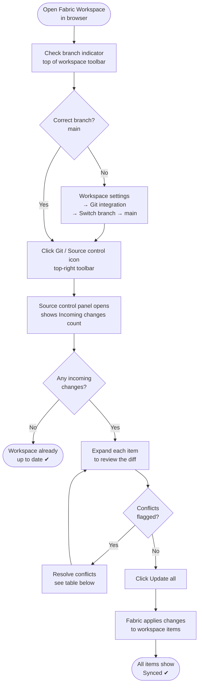

# Lab 2 — CI Pipeline & Workspace Sync for PBIP

## Overview

In this lab you will create an **Azure DevOps CI pipeline** that automatically runs whenever code is pushed to `main` or a feature branch. The pipeline will:

- Install `pbi-tools` on the build agent  
- Validate PBIP schema and metadata  
- Run DAX measure unit tests  
- Enforce lint / formatting rules  
- Publish validated artifacts  
- Report a pass/fail status back to the pull request  

Once CI is in place, getting that validated code into your **Fabric Dev workspace** can be done two ways — and this lab covers both:

| Approach | When to Use |
|---|---|
| **A — Workspace Git Sync** | Quick, on-demand pull from the portal; good for individual developers |
| **B — Pipeline-triggered sync** | Fully automated; runs as a CD stage after CI passes on `main` |

By the end of the lab, every PR targeting `main` will require a green CI check before merging, and your Dev workspace will automatically reflect the latest validated state of `main`.

---

## Objectives

1. Create an Azure DevOps pipeline using a YAML definition file  
2. Configure **branch triggers** for `main` and `feature/*`  
3. Add PBIP **validation steps** using `pbi-tools`  
4. Add **DAX unit test** execution  
5. Publish build artifacts  
6. Set the pipeline as a **required status check** on the `main` branch policy  
7. Sync validated changes into the Fabric Dev workspace using **Approach A: manual workspace sync**  
8. Sync validated changes into the Fabric Dev workspace using **Approach B: pipeline-triggered Fabric REST API sync**  

---

## Prerequisites

| Requirement | Detail |
|---|---|
| Azure DevOps project | Same project used in Lab 1; you need **Contributor** (Build) permissions |
| Repo with PBIP artifacts | Completed Lab 1 — PBIP files committed under `/fabric-workspace` |
| Agent pool | `windows-latest` hosted agent (available by default in Azure DevOps) |
| Python | Installed on the hosted agent automatically via `UsePythonVersion@0` |
| `pbi-tools` | Installed by the pipeline — no local install needed |

---

## Part 1 — Create the Pipeline Definition File

All pipeline configuration lives as code in the repo. You will create the file `azure-pipelines.yml` in the root of the repository.

### 1.1 Clone or Open the Repo

If you are working locally:

```bash
git clone https://dev.azure.com/<org>/<project>/_git/<repo>
cd <repo>
git checkout -b feature/<your-alias>-lab2
```

If you are working entirely in the browser, you can create the file directly from the Azure DevOps Repos editor.

### 1.2 Create `azure-pipelines.yml`

Create the file at the repository root with the following content:

```yaml
# azure-pipelines.yml
# CI pipeline for Microsoft Fabric PBIP artifacts

trigger:
  branches:
    include:
      - main
      - feature/*

pr:
  branches:
    include:
      - main

pool:
  vmImage: 'windows-latest'

variables:
  PBIP_PATH: 'fabric-workspace'
  PYTHON_VERSION: '3.11'

stages:

# ─────────────────────────────────────────────────────────────────
# Stage 1 — Validate PBIP artifacts
# ─────────────────────────────────────────────────────────────────
- stage: Validate
  displayName: 'Validate PBIP'
  jobs:
  - job: ValidatePBIP
    displayName: 'Schema & Lint Validation'
    steps:

    - task: UsePythonVersion@0
      inputs:
        versionSpec: '$(PYTHON_VERSION)'
      displayName: 'Set Python version'

    - script: |
        pip install --upgrade pip
        pip install pbi-tools pbip-lint
      displayName: 'Install pbi-tools and linter'

    - script: |
        pbi-tools validate --input "$(PBIP_PATH)"
      displayName: 'Run pbi-tools schema validation'

    - script: |
        pbip-lint --path "$(PBIP_PATH)" --config .pbiplintrc.json
      displayName: 'Run PBIP lint rules'
      continueOnError: false

# ─────────────────────────────────────────────────────────────────
# Stage 2 — Run DAX unit tests
# ─────────────────────────────────────────────────────────────────
- stage: Test
  displayName: 'DAX Unit Tests'
  dependsOn: Validate
  condition: succeeded()
  jobs:
  - job: DaxTests
    displayName: 'Run DAX measure tests'
    steps:

    - task: UsePythonVersion@0
      inputs:
        versionSpec: '$(PYTHON_VERSION)'
      displayName: 'Set Python version'

    - script: |
        pip install semantic-link-labs
      displayName: 'Install semantic-link-labs'

    - script: |
        python tests/run_dax_tests.py --model-path "$(PBIP_PATH)"
      displayName: 'Execute DAX unit tests'

    - task: PublishTestResults@2
      inputs:
        testResultsFormat: 'JUnit'
        testResultsFiles: '**/test-results/*.xml'
        failTaskOnFailedTests: true
      displayName: 'Publish test results'

# ─────────────────────────────────────────────────────────────────
# Stage 3 — Publish artifacts
# ─────────────────────────────────────────────────────────────────
- stage: Publish
  displayName: 'Publish Artifacts'
  dependsOn: Test
  condition: succeeded()
  jobs:
  - job: PublishArtifacts
    displayName: 'Package and publish PBIP artifacts'
    steps:

    - task: PublishBuildArtifacts@1
      inputs:
        pathToPublish: '$(Build.SourcesDirectory)/$(PBIP_PATH)'
        artifactName: 'pbip-artifacts'
        publishLocation: 'Container'
      displayName: 'Publish PBIP artifacts'
```

---

## Part 2 — Add a Sample DAX Test Script

The pipeline references `tests/run_dax_tests.py`. Create a minimal version now so the pipeline does not fail on a missing file.

Create `tests/run_dax_tests.py` in your repo:

```python
"""
Minimal DAX unit test runner for PBIP pipelines.
Replace the placeholder assertions with real measure evaluations
using semantic-link-labs or tabular-editor scripting.
"""
import argparse
import sys
import xml.etree.ElementTree as ET
from pathlib import Path
from datetime import datetime

def run_tests(model_path: str) -> bool:
    """Run DAX validation checks and write JUnit XML results."""
    results_dir = Path("test-results")
    results_dir.mkdir(parents=True, exist_ok=True)

    # ── Define your test cases here ──────────────────────────────
    tests = [
        ("ModelFolderExists",    Path(model_path).is_dir()),
        ("DefinitionFileExists", (Path(model_path) / "definition.pbism").exists() or
                                  any(Path(model_path).rglob("*.pbism"))),
    ]
    # ─────────────────────────────────────────────────────────────

    passed = all(result for _, result in tests)

    # Write JUnit XML
    suite = ET.Element("testsuite", name="DAXTests",
                        tests=str(len(tests)),
                        failures=str(sum(1 for _, r in tests if not r)),
                        timestamp=datetime.utcnow().isoformat())
    for name, result in tests:
        case = ET.SubElement(suite, "testcase", name=name, classname="DAXTests")
        if not result:
            ET.SubElement(case, "failure", message=f"{name} check failed")

    tree = ET.ElementTree(suite)
    tree.write(results_dir / "dax-test-results.xml", xml_declaration=True, encoding="utf-8")

    return passed


if __name__ == "__main__":
    parser = argparse.ArgumentParser()
    parser.add_argument("--model-path", required=True)
    args = parser.parse_args()

    success = run_tests(args.model_path)
    sys.exit(0 if success else 1)
```

---

## Part 3 — Add a PBIP Lint Config

Create `.pbiplintrc.json` in the repo root with some example rules:

```json
{
  "rules": {
    "no-implicit-measures": true,
    "measure-description-required": false,
    "no-direct-query-on-import-model": true,
    "max-relationship-ambiguity": 0
  },
  "ignore": [
    "fabric-workspace/**/*.png"
  ]
}
```

---

## Part 4 — Commit and Push

```bash
git add azure-pipelines.yml tests/run_dax_tests.py .pbiplintrc.json
git commit -m "ci: add Azure DevOps CI pipeline for PBIP validation"
git push origin feature/<your-alias>-lab2
```

---

## Part 5 — Register the Pipeline in Azure DevOps

1. In Azure DevOps, go to **Pipelines → Pipelines → New pipeline**.  
2. Select **Azure Repos Git** (or GitHub).  
3. Choose your repository.  
4. Select **Existing Azure Pipelines YAML file**.  
5. Set **Branch** = `feature/<your-alias>-lab2` and **Path** = `/azure-pipelines.yml`.  
6. Click **Continue**, then **Run** to trigger the first build.

### Verify the Pipeline Run

1. Watch the pipeline execute through the three stages: **Validate → Test → Publish**.  
2. Each stage should pass (green).  
3. Click **Artifacts** → `pbip-artifacts` to confirm the PBIP folder was published.  
4. Click **Tests** to see the JUnit XML results.

---

## Part 6 — Set as a Required Branch Policy

1. Go to **Repos → Branches** and find `main`.  
2. Click the ellipsis and choose **Branch policies**.  
3. Under **Build validation**, click **+**.  
4. Select your new pipeline.  
5. Set **Trigger** = Automatic, **Policy requirement** = Required.  
6. Set a **build expiration** of 12 hours.  
7. Save.

From this point forward, every PR targeting `main` must have a passing CI build before merging.

---

## Part 7 — Open and Merge the Lab 2 PR

1. Open a PR from `feature/<your-alias>-lab2` into `main`.  
2. The CI pipeline triggers automatically on PR creation.  
3. Wait for all three stages to pass.  
4. Request a reviewer, get approval, then merge using **Squash merge**.  
5. Delete the feature branch.

---

## Part 8 — Sync Changes into the Fabric Dev Workspace

After a PR merges to `main`, the PBIP artifacts in the repo are ahead of what is currently loaded in the Fabric Dev workspace. There are two supported ways to close that gap.

---

### Approach A — Manual Workspace Git Sync

This is the simplest method. A developer manually triggers the sync from inside the Fabric portal using the built-in **Source control** panel — no pipelines or scripts required.

#### When to use
- Ad-hoc development sessions  
- When you want to review what is about to be pulled before applying it  
- Environments where automated service principal access is not yet configured  

#### Portal flow at a glance



---

#### Step-by-step UI walkthrough

**Step 1 — Open your workspace and verify the branch**

1. In the [Microsoft Fabric portal](https://app.fabric.microsoft.com), click your **Dev workspace** in the left navigation pane.  
2. Look at the **toolbar at the top of the workspace view**. You will see a small branch indicator showing the currently connected Git branch.  
   - If it shows `main` → proceed to Step 2.  
   - If it shows a feature branch → go to **Workspace settings → Git integration → Branch → Switch branch**, select `main`, then click **Update**.

   ```
   Workspace toolbar:
   ┌─────────────────────────────────────────────────────────────┐
   │  WS-Dev-FinanceBI    [⎇ main ▾]          [⋮]  [Source control icon] │
   └─────────────────────────────────────────────────────────────┘
   ```

---

**Step 2 — Open the Source control panel**

1. Click the **Source control icon** (a small branch/git icon) in the **top-right corner** of the workspace toolbar.  
   - Alternatively, click the **ellipsis (⋮)** next to the workspace name and choose **Source control**.  
2. The **Source control** side panel slides open on the right side of the screen.

   ```
   Source control panel:
   ┌──────────────────────────────────┐
   │  Source control                  │
   │  Branch: main                    │
   │  ─────────────────────────────── │
   │  Incoming changes  (3)           │
   │  Outgoing changes  (0)           │
   └──────────────────────────────────┘
   ```

---

**Step 3 — Review incoming changes**

1. The panel shows two sections:
   - **Incoming changes** — commits on `main` in Git that are not yet in your workspace.  
   - **Outgoing changes** — local workspace edits not yet committed to Git.  

2. Click the **arrow / chevron** next to each item in **Incoming changes** to expand the diff.  
   Each entry shows:
   - **Item name** (e.g., `SalesReport.Report`)  
   - **Change type**: Modified / Added / Deleted  
   - **File-level diff** — click the file name to open a side-by-side diff viewer showing exactly what changed in the JSON/YAML/TMDL source.

   ```
   Incoming changes (3)
   ┌────────────────────────────────────────────────────────────────┐
   │ ▼ SalesReport.Report             Modified                      │
   │     report.json                  ~ 2 lines changed             │
   │ ▼ SalesModel.SemanticModel       Modified                      │
   │     model.bim                    ~ 5 lines changed             │
   │ ▼ SalesDataflow.Dataflow         Added                         │
   │     dataflow.json                new file                      │
   └────────────────────────────────────────────────────────────────┘
   ```

3. If outgoing changes exist, **commit them first** before proceeding (see conflict resolution below).

---

**Step 4 — Update the workspace**

1. Once you are satisfied with the diff review, click **Update all** at the top of the **Incoming changes** section.  

   ```
   Incoming changes (3)       [Update all]
   ```

2. A progress indicator appears while Fabric applies the changes. For each item:
   - The item is updated in-place in the workspace.  
   - Fabric re-opens the item with the latest state from Git.  

3. When complete, all items return to a **Synced** (green check ✔) state. The **Incoming changes** count drops to **0**.

   ```
   Source control panel after sync:
   ┌──────────────────────────────────┐
   │  Source control                  │
   │  Branch: main                    │
   │  ─────────────────────────────── │
   │  Incoming changes  (0)  ✔        │
   │  Outgoing changes  (0)           │
   │                                  │
   │  Up to date with remote.         │
   └──────────────────────────────────┘
   ```

> **Tip:** Refresh the workspace item list after the sync to confirm the updated versions are loaded. Cached previews in the portal may still show the old state for a few seconds.

---

#### Conflict resolution

Conflicts occur when the same item has both local (outgoing) changes and incoming Git changes. Fabric surfaces these as warnings in the Source control panel.

| Conflict type | How it appears in UI | Resolution |
|---|---|---|
| Local edit vs incoming Git change | Item shows warning icon ⚠ in both Incoming and Outgoing sections | Click **Commit** on your outgoing change first, or click **Undo changes** to discard your local edit, then click **Update all** |
| Item deleted in Git but modified locally | "Conflict — item removed in remote" warning | Click **Accept remote** in the conflict banner to remove the item, or restore from a previous Git commit |
| Schema conflict in semantic model | "Conflict" badge on the semantic model item | Use **Source control → Undo changes** next to the item to reset it to the Git state, then re-pull |
| Branch mismatch (workspace on wrong branch) | Incoming changes appear empty despite known repo changes | Switch branch back to `main` via **Workspace settings → Git integration → Switch branch** |

---

### Approach B — Pipeline-Triggered Sync (Fabric REST API)

This approach adds an automated **CD stage** to your existing `azure-pipelines.yml`. After all CI stages pass on `main`, the pipeline calls the **Fabric REST API** to trigger the same "Update from Git" operation without any manual steps.

#### When to use
- You want the Dev workspace to always reflect `main` automatically after a merge  
- Teams with multiple developers where nobody should need to remember to sync  
- Part of a larger automated promotion workflow  

#### 8.1 Create a Service Principal for API Access

1. In **Azure Active Directory (Entra ID)**, register a new App registration (or use the existing CI/CD service principal).  
2. Note the **Client ID** and **Tenant ID**.  
3. Create a **Client Secret** and store it in **Azure Key Vault** under the secret name `fabric-sp-secret`.  
4. In the **Fabric Admin Portal → Tenant settings**, enable:  
   - *Service principals can use Fabric APIs*  
   - *Service principals can access read-only admin APIs* (optional but useful for auditing)  
5. Add the service principal to the Dev workspace as **Member**.

#### 8.2 Add a Pipeline Variable Group

1. In Azure DevOps, go to **Pipelines → Library → + Variable group**.  
2. Name it `fabric-cd-vars`.  
3. Enable **Link secrets from Azure Key Vault** and link your Key Vault.  
4. Add the following variables:

   | Variable | Value | Secret |
   |---|---|---|
   | `FABRIC_TENANT_ID` | Your Entra Tenant ID | No |
   | `FABRIC_CLIENT_ID` | Service principal App (client) ID | No |
   | `FABRIC_CLIENT_SECRET` | Key Vault secret reference | **Yes** |
   | `FABRIC_WORKSPACE_ID` | GUID of the Dev workspace | No |

5. Save the variable group.

#### 8.3 Add the CD Stage to `azure-pipelines.yml`

Add the following stage **after** the existing `Publish` stage:

```yaml
# ─────────────────────────────────────────────────────────────────
# Stage 4 — Sync Fabric Dev workspace from main
# Runs only on merges to main (not on PR builds)
# ─────────────────────────────────────────────────────────────────
- stage: SyncFabricDev
  displayName: 'Sync Fabric Dev Workspace'
  dependsOn: Publish
  condition: and(succeeded(), eq(variables['Build.SourceBranch'], 'refs/heads/main'))
  variables:
  - group: fabric-cd-vars
  jobs:
  - job: TriggerFabricSync
    displayName: 'Call Fabric REST API — UpdateFromGit'
    steps:

    - task: UsePythonVersion@0
      inputs:
        versionSpec: '$(PYTHON_VERSION)'
      displayName: 'Set Python version'

    - script: pip install requests
      displayName: 'Install requests'

    - script: |
        python scripts/sync_fabric_workspace.py \
          --tenant-id    "$(FABRIC_TENANT_ID)" \
          --client-id    "$(FABRIC_CLIENT_ID)" \
          --client-secret "$(FABRIC_CLIENT_SECRET)" \
          --workspace-id  "$(FABRIC_WORKSPACE_ID)"
      displayName: 'Trigger Fabric workspace sync from Git'
```

#### 8.4 Create the Sync Script

Create `scripts/sync_fabric_workspace.py` in the repository:

```python
"""
Triggers a Fabric workspace Git sync (UpdateFromGit) via the Fabric REST API.
Uses a service principal with client credentials flow.
"""
import argparse
import sys
import time
import requests

FABRIC_API = "https://api.fabric.microsoft.com/v1"
AAD_TOKEN_URL = "https://login.microsoftonline.com/{tenant_id}/oauth2/v2.0/token"


def get_token(tenant_id: str, client_id: str, client_secret: str) -> str:
    resp = requests.post(
        AAD_TOKEN_URL.format(tenant_id=tenant_id),
        data={
            "grant_type": "client_credentials",
            "client_id": client_id,
            "client_secret": client_secret,
            "scope": "https://api.fabric.microsoft.com/.default",
        },
        timeout=30,
    )
    resp.raise_for_status()
    return resp.json()["access_token"]


def update_workspace_from_git(workspace_id: str, token: str) -> None:
    url = f"{FABRIC_API}/workspaces/{workspace_id}/git/updateFromGit"
    headers = {"Authorization": f"Bearer {token}", "Content-Type": "application/json"}
    # allowOverrideItems=True lets the API overwrite workspace items with Git state
    payload = {"updateStrategy": "PreferGit", "allowOverrideItems": True}

    resp = requests.post(url, json=payload, headers=headers, timeout=60)

    if resp.status_code == 200:
        print("Sync completed synchronously.")
        return
    if resp.status_code == 202:
        # Long-running operation — poll the operation status
        operation_url = resp.headers.get("Location") or resp.headers.get("x-ms-operation-id")
        _poll_operation(operation_url, headers)
        return

    resp.raise_for_status()


def _poll_operation(operation_url: str, headers: dict, max_wait: int = 120) -> None:
    print(f"Long-running operation started. Polling: {operation_url}")
    elapsed = 0
    while elapsed < max_wait:
        time.sleep(5)
        elapsed += 5
        r = requests.get(operation_url, headers=headers, timeout=30)
        r.raise_for_status()
        state = r.json().get("status", "").lower()
        print(f"  [{elapsed}s] status: {state}")
        if state == "succeeded":
            print("Workspace sync completed successfully.")
            return
        if state in ("failed", "cancelled"):
            error = r.json().get("error", {})
            print(f"Sync failed: {error}")
            sys.exit(1)
    print("Timed out waiting for sync operation.")
    sys.exit(1)


if __name__ == "__main__":
    parser = argparse.ArgumentParser()
    parser.add_argument("--tenant-id", required=True)
    parser.add_argument("--client-id", required=True)
    parser.add_argument("--client-secret", required=True)
    parser.add_argument("--workspace-id", required=True)
    args = parser.parse_args()

    token = get_token(args.tenant_id, args.client_id, args.client_secret)
    update_workspace_from_git(args.workspace_id, token)
```

#### 8.5 Commit and Verify

```bash
git add scripts/sync_fabric_workspace.py
git commit -m "ci: add Fabric workspace sync stage to CD pipeline"
git push origin feature/<your-alias>-lab2
```

After the PR merges to `main`, watch the pipeline run. The fourth stage **Sync Fabric Dev Workspace** should appear and complete. Verify by opening the Fabric workspace — all items should show **Synced** without any manual action.

---

## Approach Comparison

| | Approach A — Manual Sync | Approach B — Pipeline Sync |
|---|---|---|
| **Trigger** | Developer clicks "Update all" in portal | Automatic after CI passes on `main` |
| **Setup effort** | None — works immediately | Service principal, Key Vault, variable group |
| **Visibility** | Developer sees diff before applying | Logged in pipeline run history |
| **Risk** | Human may forget to sync | Misconfigured SP can block the workspace |
| **Best for** | Individual feature work | Team shared Dev workspace |

> Both approaches are valid and complementary. Many teams use **Approach A** during active development and **Approach B** as the authoritative final sync after a PR merge.

---

## Validation Checklist

**CI Pipeline**
- [ ] `azure-pipelines.yml` committed to the repo root  
- [ ] `tests/run_dax_tests.py` and `.pbiplintrc.json` committed  
- [ ] Pipeline created in Azure DevOps and run successfully at least once  
- [ ] All three stages (Validate, Test, Publish) pass  
- [ ] JUnit test results visible in the pipeline run  
- [ ] `pbip-artifacts` published and browsable  
- [ ] Pipeline added as a required status check on `main`  
- [ ] Lab 2 PR merged to `main` with CI green  

**Approach A — Manual Workspace Sync**
- [ ] Fabric Dev workspace is connected to the `main` branch  
- [ ] "Update all" triggered from the Source control panel after PR merge  
- [ ] All workspace items show **Synced** status  

**Approach B — Pipeline-Triggered Sync**
- [ ] Service principal created and added to Dev workspace as Member  
- [ ] `fabric-cd-vars` variable group created with Key Vault-linked secret  
- [ ] `scripts/sync_fabric_workspace.py` committed to the repo  
- [ ] Fourth pipeline stage (SyncFabricDev) runs and completes successfully on a `main` merge  
- [ ] Fabric Dev workspace shows **Synced** after the pipeline run without any manual action  

---

## Troubleshooting

| Issue | Resolution |
|---|---|
| `pbi-tools: command not found` | Ensure the `pip install pbi-tools` step runs before validate. Check Python path on the agent. |
| Validation fails with schema errors | Open the failing diff in the pipeline logs. Common cause: a file was manually edited outside the portal. Revert or re-sync from Fabric. |
| `run_dax_tests.py` — `ModuleNotFoundError` | Ensure `pip install semantic-link-labs` step completes before the test step. |
| JUnit XML not found | Confirm `test-results/dax-test-results.xml` is written before the `PublishTestResults` task runs. |
| Branch policy not triggering CI | On the branch policy page, verify the pipeline name exactly matches and that **Trigger** is set to **Automatic**, not Manual. |
| Pipeline stuck in "Waiting for agent" | Check that the `windows-latest` hosted agent pool has capacity. During workshops, use a self-hosted agent if available. |
| **Approach A:** "Update all" shows no pending changes but workspace feels stale | Confirm the workspace branch is set to `main` (not a feature branch). Switch branch in Git integration settings if needed. |
| **Approach A:** Conflict warning on sync | Commit or discard any local workspace edits before syncing. Use "Undo changes" in Source control to clear them. |
| **Approach B:** `401 Unauthorized` from Fabric API | Confirm the service principal's client secret has not expired. Check Key Vault secret version. |
| **Approach B:** `403 Forbidden` from Fabric API | Ensure *Service principals can use Fabric APIs* is enabled in the Fabric Admin portal, and the SP has at least **Member** role on the workspace. |
| **Approach B:** Sync returns 202 but script times out | The workspace had many items to update. Increase `max_wait` in `_poll_operation` or re-run the stage manually. |
| **Approach B:** Stage skipped on PR builds | Expected — the `condition` filter restricts the stage to `refs/heads/main` only. PRs from feature branches skip it by design. |

---

## Extension Exercises *(if time permits)*

1. **Add a schema-diff check** — compare the current model against the last successful build artifact to detect unreviewed structural changes.  
2. **Integrate Tabular Editor BPA** — run [Best Practice Analyzer](https://github.com/TabularEditor/TabularEditor) rules as an extra validation step.  
3. **Add a deployment job** — after CI passes on `main`, use the Fabric REST API to trigger a workspace sync in the Test environment.  
4. **Slack / Teams notification** — add a final step that posts a message to a Teams channel when the pipeline succeeds or fails.

---

## Next Steps

With CI protecting `main`, return to the workshop plan for the **Deployment Strategy** session: promoting your validated artifacts from Dev → Test → Prod using Fabric Deployment Pipelines.

See [CI/CD Architecture](../../architecture/cicd-architecture.md) for the end-to-end diagram.
